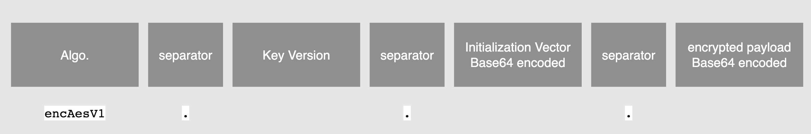

# Usage of the Kafka Messaging End-To-End-Encryption library

### Table of Content

* [Build an EncryptionKeyProvider](#step-0-create-an-encryptionkeyprovider)
* [Full-Message-Encryption workflow](#full-message-encryption-workflow)
* [Field-Level-Encryption workflow](#field-level-encryption-workflow)
* [Caching](#caching)
* [Key Rotation](#key-rotation)

## Include Library to your build

```groovy
dependencies {
    implementation "de.otto:kafka-messaging-e2ee:2.3.1"
}
```

## Step 0: create an EncryptionKeyProvider

### Option 1: Use SingleTopicVaultEncryptionKeyProviderConfig for simple use cases.

```java
class Example {
  void example() {
    VaultConnectionConfig vaultConnectionConfig = VaultConnectionConfig.builder()
        // use token or appRole
        .token("some token")
        .build();

    VaultEncryptionKeyProviderConfig vaultEncryptionKeyProviderConfig = SingleTopicVaultEncryptionKeyProviderConfig.builder()
        .isEncryptedTopic(true)
        .vaultConnectionConfig(vaultConnectionConfig)
        .vaultPath("galapagos/local/galapagos_someTeam/someKafkaTopic")
        .build();

    EncryptionKeyProvider encryptionKeyProvider = new VaultEncryptionKeyProvider(
        vaultEncryptionKeyProviderConfig);
  }
}
```

### Option 2: Use MultiTopicVaultEncryptionKeyProviderConfig when you consume from and/or publish to multiple kafka topics.

```java
class Example {
  void example() {
    VaultConnectionConfig vaultConnectionConfig = VaultConnectionConfig.builder()
        // use token or appRole
        .token("some token")
        .build();

    VaultEncryptionKeyProviderConfig vaultEncryptionKeyProviderConfig = MultiTopicVaultEncryptionKeyProviderConfig.builder()
        .vaultConnectionConfig(VaultConnectionConfig.builder()
            // use token or appRole
            .token("dev-token")
            .build())
        .configEntry(KafkaTopicConfigEntry.builder()
            .isDefault(true)
            .vaultPathTemplate("galapagos/local/galapagos_%TEAMNAME%/%TOPICNAME%")
            .build())
        .configEntry(KafkaTopicConfigEntry.builder()
            .teamName("someTeam-One")
            .kafkaTopicName("some-topic")
            .build())
        .configEntry(KafkaTopicConfigEntry.builder()
            .teamName("someTeam-Two")
            .kafkaTopicName("some-other-topic")
            .encryptionKeyAttributeName("aes")
            .build())
        .build();

    EncryptionKeyProvider encryptionKeyProvider = new VaultEncryptionKeyProvider(
        vaultEncryptionKeyProviderConfig);
  }
}
```


## Full-Message-Encryption workflow

### Step 1: create a EncryptionService and/or DecryptionService

The main class you need is a [EncryptionService](../src/main/java/de/otto/kafka/messaging/e2ee/EncryptionService.java)
and/or [DecryptionService](../src/main/java/de/otto/kafka/messaging/e2ee/DecryptionService.java).

```java
class Example {
  void example() {
    EncryptionService encryptionService = new EncryptionService(encryptionKeyProvider);
    DecryptionService decryptionService = new DecryptionService(encryptionKeyProvider);
  }
}
```

### Step 2: use EncryptionService to encrypt messages

```java
class Example {

  void example() {
    String kafkaTopicName = "some-topic";
    String plainTextPayload = "Hello World!";
    AesEncryptedPayload aesEncryptedPayload = encryptionService.encryptPayloadWithAes("some-topic",
        plainTextPayload);

    // now you have to store the metadata next to the encrypted payload itself
    System.out.println("Encrypted Payload: " + Arrays.toString(aesEncryptedPayload.encryptedPayload()));
    System.out.println("Key Version: " + aesEncryptedPayload.keyVersion());
    System.out.println("Initialization Vector: " + aesEncryptedPayload.initializationVectorBase64());
    
    // in order to get the Kafka Headers use
    Map<String, byte[]> kafkaHeaders = null;
    if (aesEncryptedPayload.isEncrypted()) {
      kafkaHeaders = KafkaEncryptionHelper.mapToKafkaHeadersForValue(aesEncryptedPayload);
      System.out.println("Kafka Headers: " + kafkaHeaders);
    }
  }
}
```

### Step 3: use DecryptionService to decrypt messages

#### Option 1 - Step 3: use DecryptionService to decrypt messages with map of Kafka Headers

```java
class Example {

  void example() {
    // metadata attributes for Kafka Headers (values can be String or byte[])
    String kafkaTopicName = "some-topic";
    Map<String, Object> kafkaHeaders = new HashMap<>();
    kafkaHeaders.put(KafkaEncryptionHelper.KAFKA_HEADER_IV_VALUE, "2rW2tDnRdwRg87Ta");
    kafkaHeaders.put(KafkaEncryptionHelper.KAFKA_HEADER_CIPHER_VALUE, "[{\"encryption_key\":{\"cipherVersionString\":null,\"cipherVersion\":3,\"cipherName\":\"encryption_key\"}}]");
    kafkaHeaders.put(KafkaEncryptionHelper.KAFKA_CE_HEADER_IV_VALUE, "2rW2tDnRdwRg87Ta");
    kafkaHeaders.put(KafkaEncryptionHelper.KAFKA_CE_HEADER_CIPHER_VERSION_VALUE, "3");
    kafkaHeaders.put(KafkaEncryptionHelper.KAFKA_CE_HEADER_CIPHER_NAME_VALUE, "encryption_key");

    // the encrypted payload
    byte[] encryptedPayloadByteArray = Base64.getDecoder().decode("6ttHpHYw7eYQ1OnvrhZAFi0PPsUGl9NR18hXFQ==");

    // perform decryption
    AesEncryptedPayload encryptedPayload = KafkaEncryptionHelper.aesEncryptedPayloadOfKafkaForValue(
        encryptedPayloadByteArray, kafkaHeaders);
    String plainText = decryptionService.decryptToString(kafkaTopicName, encryptedPayload);

    // print result
    System.out.println("Plain Text Payload: " + plainText);
  }
}
```

#### Option 2 - Step 3: use DecryptionService to decrypt messages with individual Kafka Headers

```java
class Example {

  void example() {
    // meta data attributes for Kafka Headers
    String kafkaTopicName = "some-topic";
    byte[] kafkaHeaderInitializationVector = kafkaHeaders.get(KafkaEncryptionHelper.KAFKA_HEADER_IV_VALUE);
    byte[] kafkaHeaderCiphersText = kafkaHeaders.get(KafkaEncryptionHelper.KAFKA_HEADER_CIPHER_VALUE);
    byte[] kafkaCeHeaderInitializationVector = kafkaHeaders.get(KafkaEncryptionHelper.KAFKA_CE_HEADER_IV_VALUE);
    byte[] kafkaCeHeaderCipherVersion = kafkaHeaders.get(KafkaEncryptionHelper.KAFKA_CE_HEADER_CIPHER_VERSION_VALUE);
    byte[] kafkaCeHeaderCipherName = kafkaHeaders.get(KafkaEncryptionHelper.KAFKA_CE_HEADER_CIPHER_NAME_VALUE);

    // the encrypted payload
    byte[] encryptedPayloadByteArray = Base64.getDecoder().decode("6ttHpHYw7eYQ1OnvrhZAFi0PPsUGl9NR18hXFQ==");

    // perform decryption
    AesEncryptedPayload encryptedPayload = KafkaEncryptionHelper.aesEncryptedPayloadOfKafka(
        encryptedPayloadByteArray, kafkaHeaderInitializationVector, kafkaHeaderCiphersText,
        kafkaCeHeaderInitializationVector, kafkaCeHeaderCipherVersion, kafkaCeHeaderCipherName
    );
    String plainText = decryptionService.decryptToString(kafkaTopicName, encryptedPayload);

    // print result
    System.out.println("Plain Text Payload: " + plainText);
  }
}
```


## Field-Level-Encryption workflow

### Structure of an encrypted field




### Step 1: create a SingleTopicFieldLevelEncryptionService and/or SingleTopicFieldLevelDecryptionService

The main class you need is a [SingleTopicFieldLevelEncryptionService](../src/main/java/de/otto/kafka/messaging/e2ee/fieldlevel/SingleTopicFieldLevelEncryptionService.java)
and/or [SingleTopicFieldLevelDecryptionService](../src/main/java/de/otto/kafka/messaging/e2ee/fieldlevel/SingleTopicFieldLevelDecryptionService.java).

You can also use the classes [FieldLevelEncryptionService](../src/main/java/de/otto/kafka/messaging/e2ee/fieldlevel/FieldLevelEncryptionService.java)
and/or [FieldLevelDecryptionService](../src/main/java/de/otto/kafka/messaging/e2ee/fieldlevel/FieldLevelDecryptionService.java).

```java
class Example {
  void example() {
    String kafkaTopicName = "some-topic";
    SingleTopicFieldLevelEncryptionService fieldLevelEncryptionService = new SingleTopicFieldLevelEncryptionService(encryptionKeyProvider, kafkaTopicName);
    SingleTopicFieldLevelDecryptionService fieldLevelDecryptionService = new SingleTopicFieldLevelDecryptionService(encryptionKeyProvider, kafkaTopicName);
  }
}
```

### Step 2: use SingleTopicFieldLevelEncryptionService to encrypt parts of a message

```java
class Example {

  void example() {
    String plainTextFieldValue = "Hello World!";
    EncryptedString encryptedString = fieldLevelEncryptionService.encryptToEncryptedString(plainTextFieldValue);

    // now you have to store the metadata next to the encrypted payload itself
    System.out.println("Encrypted Payload: " + encryptedString.value());
  }
}
```

### Step 3: use SingleTopicFieldLevelDecryptionService to decrypt parts of the messages

```java
class Example {
  void example() {
    // the encrypted payload (Format is: ""encAesV1."<key version>"."<Initialization Vector base 64 encoded>"."<encrypted payload base 64 encoded> )
    EncryptedString encryptedString = EncryptedString.of("encAesV1.3.2rW2tDnRdwRg87Ta.6ttHpHYw7eYQ1OnvrhZAFi0PPsUGl9NR18hXFQ=="); 
    
    // perform decryption
    String plainText = fieldLevelDecryptionService.decrypt(encryptedString);

    // print result
    System.out.println("Plain Text Payload: " + plainText);
  }
}
```


# Caching

The retrieved encryption keys from the vault will be cached for 1 hour.
Its recommended using a 2nd-Level-Cache to avoid outages when the vault in not reachable.
So in case of a downtime of the central vault the operation of your service is not discontinued.

See [CACHING.md](CACHING.md).


# Key Rotation

In order to rotate the encryption key (for the example vault) see [ROTATE-SHARED-ENCRYPTION-KEY.md](ROTATE-SHARED-ENCRYPTION-KEY.md).
